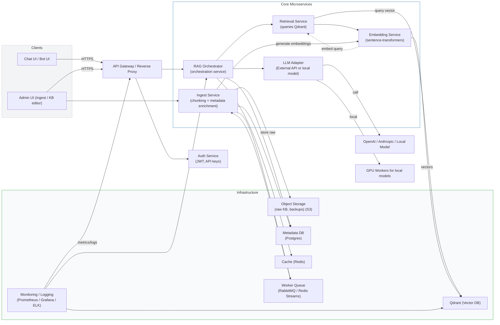

# Microservices Architecture (Mermaid)

Below is a microservices-style architecture diagram for the current RAG project and recommended upgrades. Paste the Mermaid block into a Mermaid-enabled viewer (VS Code, Mermaid Live Editor, GitHub Markdown with Mermaid enabled) to visualize.

## How the pieces interact (simple)
- Clients (`Chat UI`) call the `API Gateway`, which routes requests and validates auth.
- The `RAG Orchestrator` coordinates a query: it asks the `Embedding Service` to embed the user query, calls `Retrieval Service` to search `Qdrant`, then forwards retrieved chunks to the `LLM Adapter` to produce the final answer.
- `Ingest Service` (used by admins or a scheduler) reads `kb.txt` (or other sources in `Object Storage`), runs chunking and metadata enrichment, asks `Embedding Service` to create vectors and stores them in `Qdrant`. It also saves metadata to `Postgres`.
- `Worker Queue` and background workers handle heavy tasks (large ingestion, batch embedding, reindexing).
- `Cache` stores recent retrievals and answers for low-latency responses.

## Recommended upgrades and notes
- Token-aware chunking: replace naive char-based chunking with token-count-aware splitting (keeps semantic coherence).
- Embedding Service as a separate scalable microservice: isolates model infra and lets you scale embedding workers independently (GPU autoscaling).
- Embedding cache: cache embeddings for unchanged documents to avoid recomputation.
- Metadata store: store `source`, `section`, `version`, `author` in `MetaDB` so retrieved chunks are traceable.
- Use async ingestion and batch upserts into Qdrant to improve throughput for large KBs.
- Add a small `Search API` microservice (or integrate in Retrieval) to translate client queries into vector search + filtering by metadata.
- Observability: add tracing (OpenTelemetry), structured logs, and metrics for vector DB ops.
- Deploy with Docker Compose for local dev; Helm + Kubernetes for production with HPA for Embedding and Retrieval services.
- Security: lock down Qdrant endpoints (private network), use mTLS or API keys for inter-service auth.

## Deployment & operational suggestions
- Local dev: `docker-compose` with Qdrant, Redis, Postgres, and a small mock LLM / API proxy.
- Prod: Kubernetes with node pools (CPU nodes for API/Orchestrator, GPU nodes for Embedding/LLM), autoscale, and use managed Qdrant Cloud if you prefer.
- Backups: periodically export Qdrant snapshots and store raw KB in object storage.

## Files in this repo mapped to the architecture
- `knowledgebase-for-rag/kb.txt` — raw content source (goes into `Object Storage` or Git).
- `knowledgebase-for-rag/qdrant_ingest.py` — simple `Ingest Service` prototype (local, synchronous).
- `knowledgebase-for-rag/chunks.py` — chunking helpers (candidate for token-aware chunker microservice).
- `knowledgebase-for-rag/rag_system.py` — integration ideas / orchestrator code (could become `Orchestrator` microservice).
- `knowledgebase-for-rag/requirements-qdrant.txt` — dependencies for embedding and ingestion (used by the Embedding/Ingest services).

---
Would you like me to:
- produce a `docker-compose.yml` that wires Qdrant + Redis + Postgres + a simple API container for local testing, or
- convert `qdrant_ingest.py` to a small FastAPI-based `Ingest Service` with endpoints for admin-triggered ingestion?
